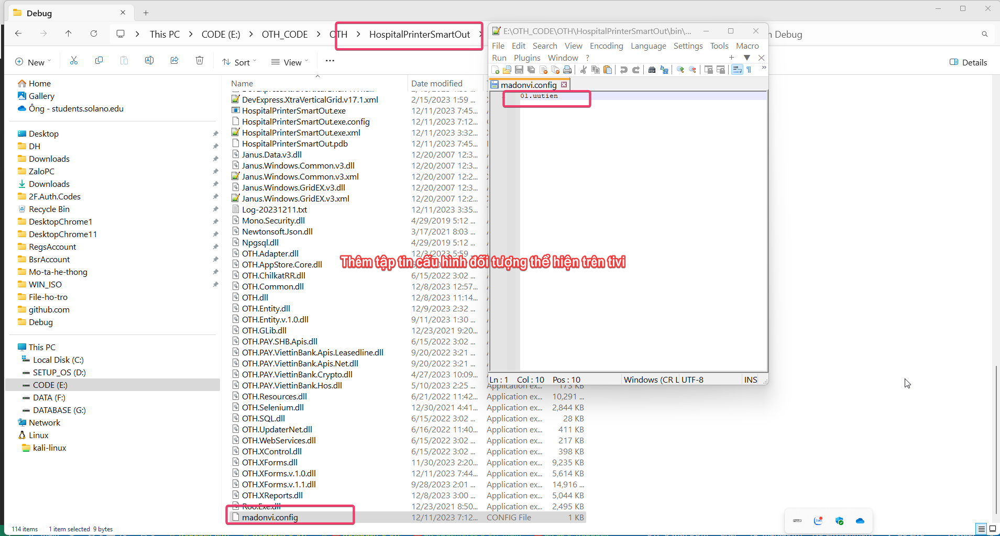
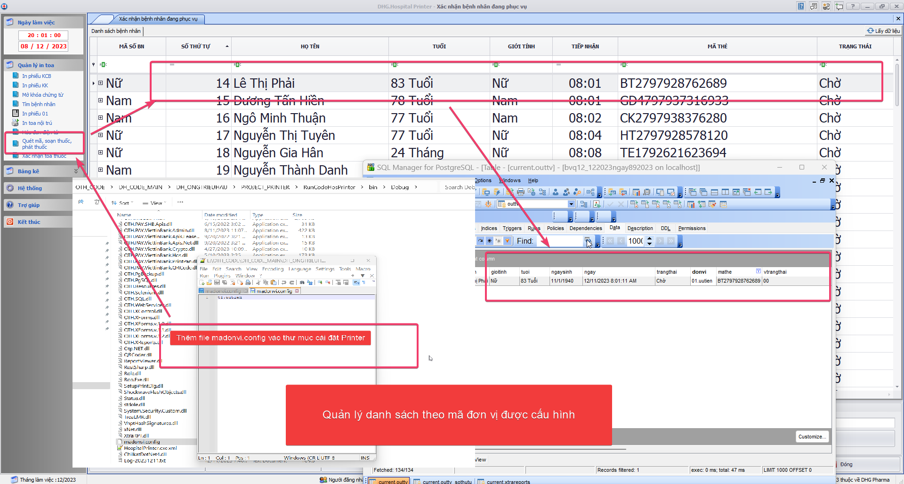
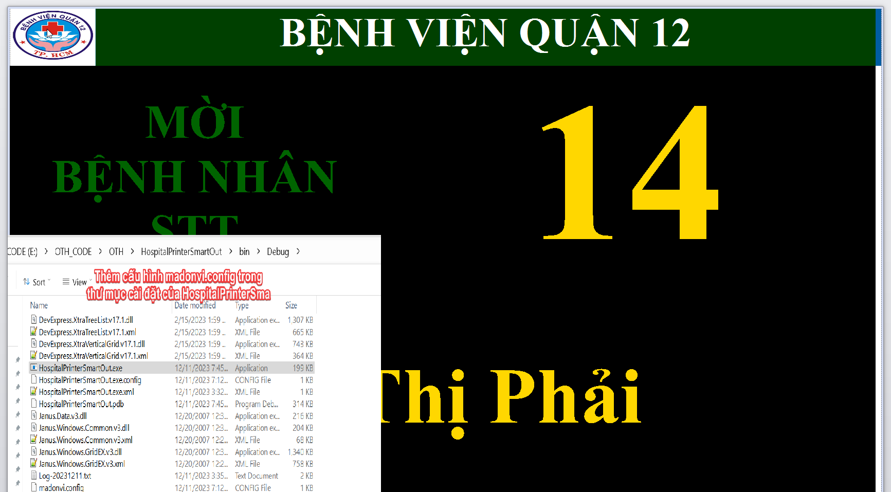
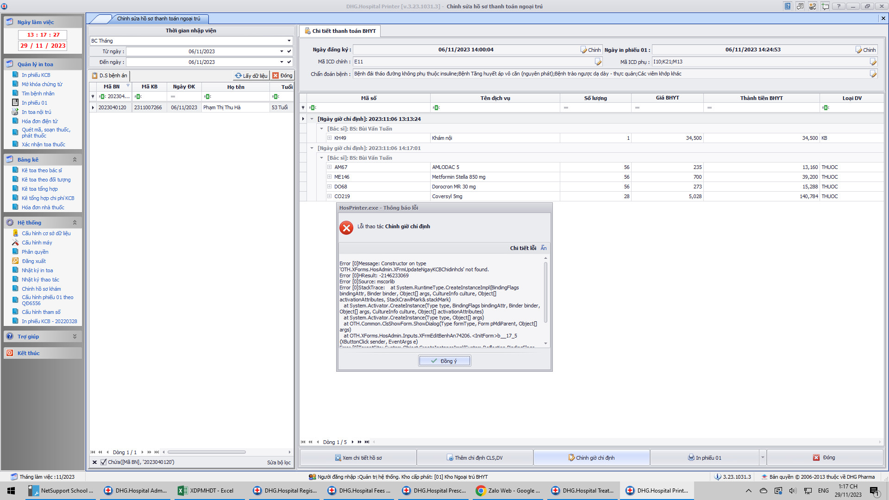
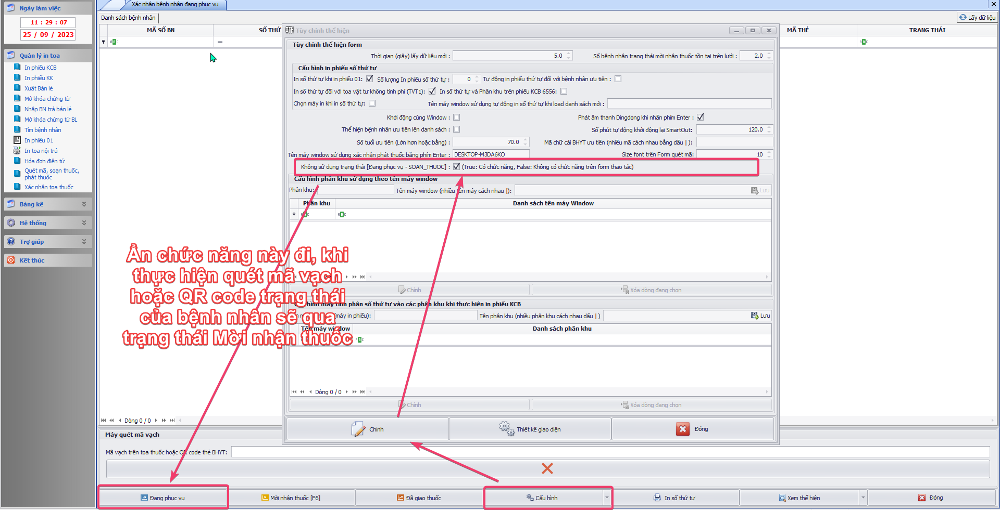
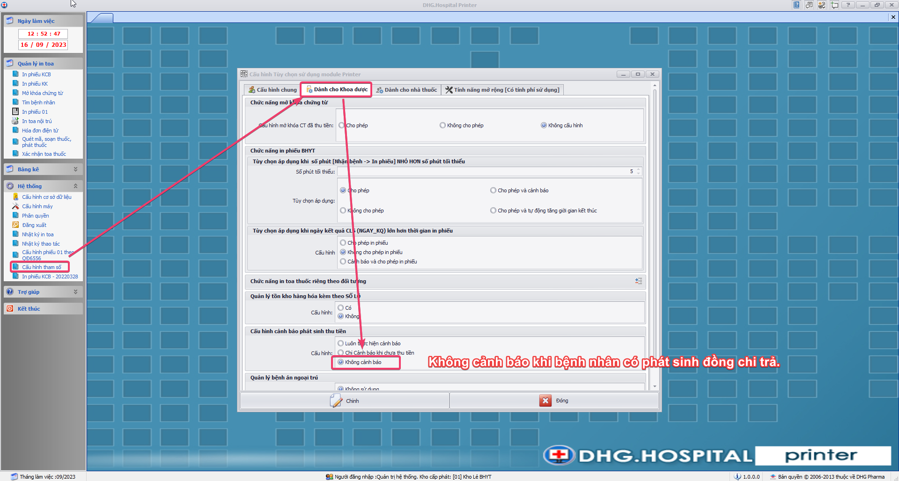
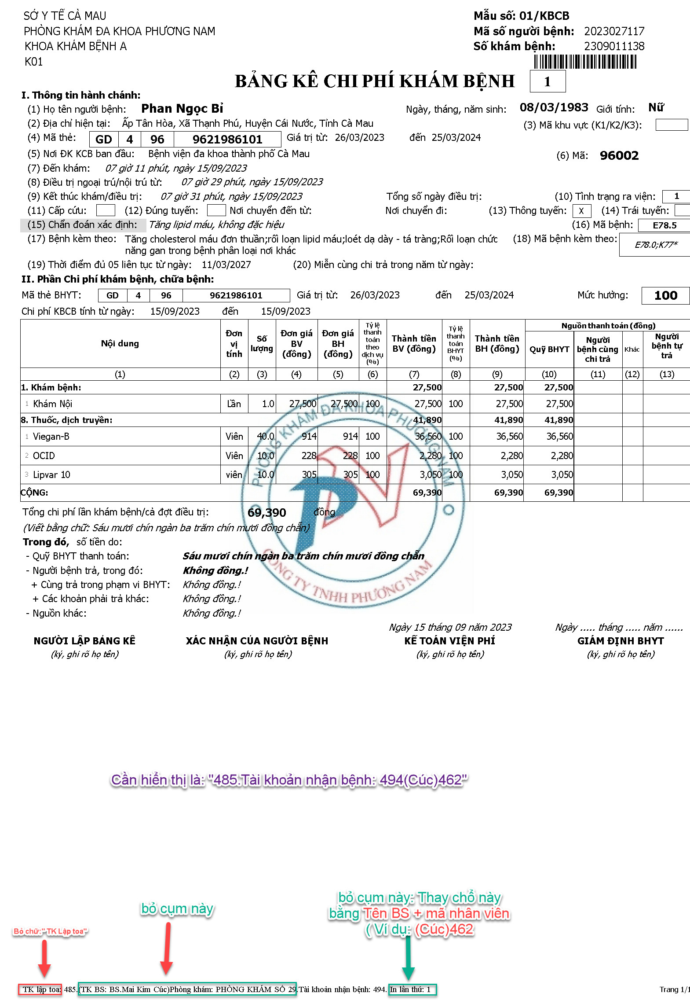
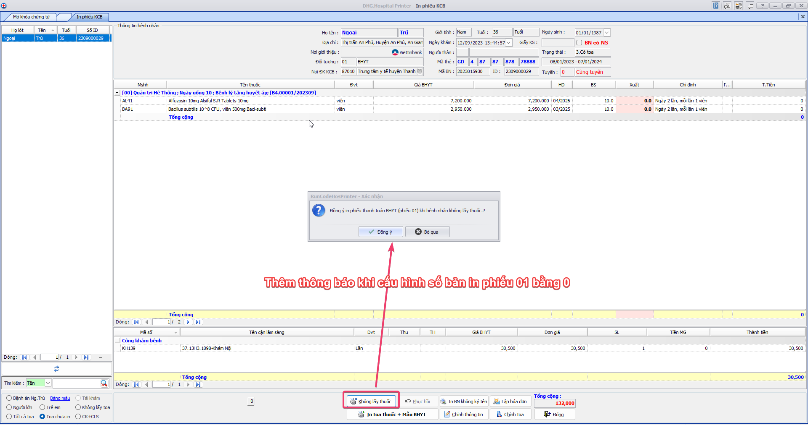
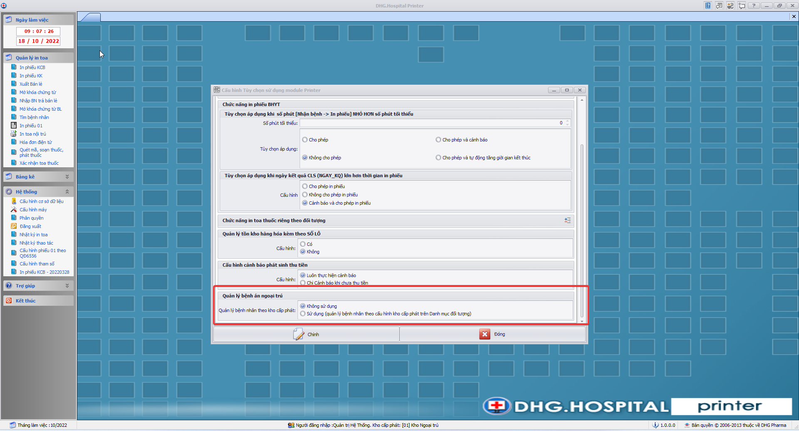

### DHG.Hospital Printer - Thông tin cập nhật

(✨: Chức năng mới,🐛: Chỉnh lỗi, #️⃣: Giải quyết công việc) 

##### [v3.23.1211.1]()

- ✨: Bổ sung chức năng in phiếu đối với bệnh nhân ưu tiên (BV Quận 12). Mặc định Printer hoặc HospitalPrinterSmartOut sẽ lấy mã đơn vị sẽ theo `kho cấp phát`, đối tượng ưu tiên của kho này sẽ được ghép chuỗi `".uutien"` phía sau. Để cấu hình thể hiện đối tượng ưu tiên phải cấu hình thêm `madonvi.config` trong thư mục cài đặt (nếu không có tập tin `madonvi.config` này thì chương trình sẽ lấy mặc định theo kho cấp phát). 

##### [v3.23.1130.1]()

- 🐛: Fix Lỗi - Hiệu chỉnh hồ sơ bệnh án (BV Quận 12)

##### [v3.23.1031.3]()

- #️⃣: <https://github.com/dh-hos/dhg.hospitaladmin/issues/49>
- ✨: Mở chức năng chỉnh sửa hồ sơ ngoại trú [`Chỉnh hồ sơ khám`] đối với Quận 12 (`79029`) (Sếp duyệt qua Zalo)
- 🐛: Fix Lỗi - Hiệu chỉnh thông tin không cập nhật được tuyenxml (`Thay Plus.dll bằng HosReg.Plus.dll`) 

##### [v3.23.1031.2]()

-  ✨:
-  🐛:
-  #️⃣:

##### [v3.23.1031.1]()

- #️⃣: <https://github.com/dh-hos/dhg.hospitaladmin/issues/49>
- ✨: Mở chức năng chỉnh sửa hồ sơ ngoại trú [`Chỉnh hồ sơ khám`] đối với Quận 12 (Sếp duyệt qua Zalo)
- 🐛: Fix Lỗi - Hiệu chỉnh thông tin không cập nhật được tuyenxml (`Thay Plus.dll bằng HosReg.Plus.dll`)

##### [v3.23.1019.1]()

- #️⃣: <https://github.com/dh-hos/To_Lap_Trinh/issues/92>
- ✨: Thêm option cho phép cấu hình sử dụng chức năng Đang phục vụ trên form Quét mã, soạn thuốc, phát thuốc
- ✨: Yêu cầu - Hỗ trợ xuất thông tin bệnh nhân ra LCD phát thuốc BHYT

##### [v3.23.1016.4]()

- #️⃣: <https://github.com/dh-hos/To_Lap_Trinh/issues/126>
- ✨: Yêu cầu - Cấp license thêm mã đơn vị triển khai mới - BV Đa Khoa Tâm Minh Đức Tiền Giang

##### [v3.23.1016.3]()

- #️⃣: <https://github.com/dh-hos/To_Lap_Trinh/issues/126>
- ✨: Yêu cầu - Cấp license thêm mã đơn vị triển khai mới - BV Đa Khoa Tâm Minh Đức Tiền Giang

##### [v3.23.1016.2]()

- #️⃣: <https://github.com/dh-hos/dhg.hospitalprinter/issues/125#issuecomment-1763636601>
- 🐛: Fix Lỗi - Không phục hồi được toa nhà thuốc đã bấm Không lấy thuốc của toa nội trú

##### [v3.23.1016.1]()

-  ✨:
-  🐛:
-  #️⃣:

##### [v3.23.0921.1]()

- #️⃣: <https://github.com/dh-hos/To_Lap_Trinh/issues/90#issuecomment-1729169695>
- ✨: Chỉnh thông tin bệnh nhân ngoại trú: bổ sung chức năng nhập lại mã nơi đăng ký ban đầu xác định trái tuyến được hưởng như cùng tuyến.

##### [v3.23.0918.1]()

- ✨: Thêm chức năng: cho phép cấu hình không cảnh báo khi bệnh nhân có phát sinh đồng chi trả

##### [v3.23.0916.2]()

- #️⃣: <https://github.com/dh-hos/dhg.hospitalprinter/issues/82#issuecomment-1718698090>
- ✨: Fix lỗi trường hợp bệnh nhân không lấy thuốc, đồng ý in phiếu thanh toán những không ra phiếu

##### [v3.23.0916.1]()

- ✨: Thêm para ghi chú thiết kế riêng cho Phòng Khám Phương Nam - Cà Mau `Ghichu_MaNVLapToa_TKNhanbenh_TenBSMaNV_PKPHUONGNAM` trên phiếu 01 (theo yêu cầu đặc thù của phòng khám)CHANGELOG_Coding.md 

##### [v3.23.0913.6]()

- #️⃣: <https://github.com/dh-hos/dhg.hospitalprinter/issues/91>
- 🐛: Fix Lỗi - BV Cái Răng: Kê toa theo đối tượng, kê toa tổng hợp không hiển thị tuối

##### [v3.23.0913.5]()

- #️⃣: <https://github.com/dh-hos/dhg.hospitalprinter/issues/91>
- 🐛: Fix Lỗi - BV Cái Răng: Kê toa theo đối tượng, kê toa tổng hợp không hiển thị tuối

##### [v3.23.0913.4]()

- #️⃣: <https://github.com/dh-hos/dhg.hospitalprinter/issues/91>
- 🐛: Fix Lỗi - BV Cái Răng: Kê toa theo đối tượng, kê toa tổng hợp không hiển thị tuối

##### [v3.23.0913.3]()

- #️⃣: <https://github.com/dh-hos/dhg.hospitalprinter/issues/82>
- ✨: Thêm chức năng: Cho phép người dùng xác nhận có in mẫu thanh toán BHYT (phiếu 01) khi thực hiện chức năng [Không lấy thuốc] và khi cấu hình số bản in phiếu 01 bằng 0.

##### [v3.23.0913.2]()

- #️⃣: <https://github.com/dh-hos/dhg.hospitalprinter/issues/124#issuecomment-1716862474>
- 🐛: Fix lỗi khi in (Thêm chức năng ghép tên bệnh theo 3153/BYT-BH đối với bệnh nhân LAO khi xuất XML)

##### [v3.23.0913.1]()

- #️⃣: <https://github.com/dh-hos/dhg.hospitalprinter/issues/124>
- ✨: Thêm chức năng ghép tên bệnh theo 3153/BYT-BH đối với bệnh nhân LAO khi xuất XML

##### [v3.23.0912.7]()

- #️⃣: <https://github.com/dh-hos/dhg.hospitalprinter/issues/111#issuecomment-1715302987>
- 🐛: Fix Lỗi - Sai trạng thái đã in bệnh nhân không lấy thuốc toa mua ngoài (Không tác động đến trạng thái của bệnh nhân đối với nhà thuốc đối với 2 trường hợp [Không lấy toa và đồng ý in bảng kê BHYT] và [Không lấy toa và không in bảng kê BHYT])

##### [v3.23.0912.6]()

- #️⃣: <https://github.com/dh-hos/dhg.hospitalprinter/issues/124>
- 🐛: Fix Lỗi - Không ghép được tên bệnh theo công văn 3153/BYT-BH khi khám bệnh nhân Lao (Không cập nhật lại kết quả chẩn đoán kqcdoan trong psdang của bệnh lao theo công văn 3153/BYT-BH)

##### [v3.23.0912.5]()

- #️⃣: <https://github.com/dh-hos/dhg.hospitalprinter/issues/111>
- 🐛: Fix Lỗi - Sai trạng thái đã in bệnh nhân không lấy thuốc toa mua ngoài (Không tác động đến trạng thái của bệnh nhân đối với nhà thuốc)

##### [v3.23.0912.4]()

- #️⃣: <https://github.com/dh-hos/dhg.hospitalprinter/issues/104>
- ✨: Mở chức năng tìm kiếm bằng mã bệnh nhân và thực hiện in phiếu 01 đối với bệnh viện Trà Cú (84006) (Tìm theo mã bệnh nhân hoặc quét QR mã bệnh nhân)

##### [v3.23.0912.3]()

- #️⃣: <https://github.com/dh-hos/dhg.hospitalprinter/issues/116>
- ✨: Yêu cầu - Nhà thuốc không cho Xuất bán lẻ ngày cũ. (Thực hiện cho phép cấu hình trên form [Cấu hình tham số] cho phép hay không)

##### [v3.23.0912.2]()

- #️⃣: <https://github.com/dh-hos/dhg.hospitalprinter/issues/120>
- 🐛: Lỗi - Đối tượng thu phí cho vật tư kèm theo printer nhà thuốc không thấy tên bệnh nhân để phát (Thực hiện lấy những bệnh nhân thu phí có kèm toa vật tư kèm theo lên danh sách chưa in)

##### [v3.23.0912.1]()

- #️⃣: <https://github.com/dh-hos/dhg.hospitalprinter/issues/121>
- 🐛: Lỗi - Printer Phục hồi toa in lại giờ lập chứng từ thay đổi (Không thực hiện cập nhật giờ lập khi phục hồi toa)

##### [v3.23.0904.1]()

- #️⃣: <https://github.com/dh-hos/To_Lap_Trinh/issues/63>
- ✨: Thay đổi chức năng [Mở khóa và xóa giờ kết thúc khám] thành chức năng chính trên form [Mở khóa chứng từ]

##### [v3.23.0823.3]()

- #️⃣: <https://github.com/dh-hos/dhg.hospitalprinter/issues/112> 
- 🐛: Fix sai thông tin ngày sinh trên form bán lẻ, tính lại ngày tháng năm sinh khi chỉnh xong tuổi hoặc đơn vị tuổi, ngược lại tính lại tuổi và đơn vị tuổi khi chỉnh ngày tháng năm sinh (thoát khỏi control trên form sẽ tính lại)
- 🐛: Fix Lỗi - HIỂN THỊ SAI THÔNG TIN ĐƠN VỊ TUỔI - BẢNG KÊ HOÁ ĐƠN NHÀ THUỐC

##### [v3.23.0823.2]()

- #️⃣: <https://github.com/dh-hos/dhg.hospitalprinter/issues/112>
- 🐛: Fix sai thông tin ngày sinh trên form bán lẻ, tính lại ngày tháng năm sinh khi chỉnh xong tuổi hoặc đơn vị tuổi, ngược lại tính lại tuổi và đơn vị tuổi khi chỉnh ngày tháng năm sinh (thoát khỏi control trên form sẽ tính lại)
- 🐛: Fix Lỗi - HIỂN THỊ SAI THÔNG TIN ĐƠN VỊ TUỔI - BẢNG KÊ HOÁ ĐƠN NHÀ THUỐC

##### [v3.23.0823.1]()

- #️⃣: <https://github.com/dh-hos/dhg.hospitalprinter/issues/112>
- 🐛: Fix sai thông tin ngày sinh trên form bán lẻ, tính lại ngày tháng năm sinh khi chỉnh xong tuổi hoặc đơn vị tuổi, ngược lại tính lại tuổi và đơn vị tuổi khi chỉnh ngày tháng năm sinh (thoát khỏi control trên form sẽ tính lại)
- 🐛: Fix Lỗi - HIỂN THỊ SAI THÔNG TIN ĐƠN VỊ TUỔI - BẢNG KÊ HOÁ ĐƠN NHÀ THUỐC

##### [v3.23.0811.1]()

- ✨: Bổ sung chức năng thanh toán QRCode đối với bệnh viện Tim Mạch CT (92001)

##### [v3.23.0708.1]()

- #️⃣: <https://github.com/dh-hos/dhg.hospitalprinter/issues/119>
- 🐛: Fix lỗi cảnh báo sai số tiền khi bệnh nhân thuộc hộ nghèo (có mã hộ nghèo)

##### [v3.23.0704.1]()

- #️⃣: <https://github.com/dh-hos/dhg.hospitalprinter/issues/118>
- 🐛: Fix lỗi không in được số thứ tự phát thuốc khi danh sách in chỉ có 1 bệnh nhân

##### [v3.23.0630.1]()

- #️⃣: <https://github.com/dh-hos/dhg.hospitalprinter/issues/117>
- 🐛: Fix lỗi thiếu check Cấp cứu, Đúng tuyến, Thông tuyến, Trái tuyến đối với bệnh nhân lao

##### [v3.23.0628.2]()

- #️⃣: <https://github.com/dh-hos/dhg.hospitalprinter/issues/112#issuecomment-1611001181>
- 🐛: Fix lỗi sai đơn vị tính tuổi trên bảng kê Hóa đơn nhà thuốc

##### [v3.23.0628.1]()

- #️⃣: <https://github.com/dh-hos/dhg.hospitalprinter/issues/106#issuecomment-1608895385>
- ✨: Bổ sung chức năng kiểm tra chứng từ đang được lập phiếu thu ở máy khác.

##### [v3.23.0627.1]()

- #️⃣: <https://github.com/dh-hos/dhg.hospitalprinter/issues/112>
- 🐛: Fix lỗi sai đơn vị tính tuổi trên bảng kê Hóa đơn nhà thuốc

##### [v3.23.0626.1]()

- #️⃣: <https://github.com/dh-hos/dhg.hospitalprinter/issues/106>
- ✨: Hỗ trợ chức năng kiểm tra phiếu thu có được lập hddt trước khi lập HĐĐT tránh trường hợp bị trùng.

##### [v3.23.0623.1]()

- #️⃣: <https://github.com/dh-hos/Mo-ta-he-thong/issues/25>
- ✨: Cập nhật Lisence `92117`

##### [v3.23.0621.1]()

- #️⃣: <https://github.com/dh-hos/dhg.hospitaladmin/issues/43>
- ✨: Cập nhật Lisence `77155`

##### [v3.23.0606.2]()

- #️⃣: <https://github.com/dh-hos/dhg.hospitalprinter/issues/115>
- 🐛: Fix lỗi không in phiếu 01 khi có CLS miễn giảm 100%
- #️⃣: <https://github.com/dh-hos/dhg.hospitaladmin/issues/42#issuecomment-1578201157>
- ✨: Cập nhật Lisence `77156`

##### [v3.23.0606.1]()

- #️⃣: <https://github.com/dh-hos/dhg.hospitalprinter/issues/114>
- ✨: Bổ sung tùy chọn cho phép cấu hình số lượng Xuất phải nhỏ hơn số lượng theo đơn Bác sĩ khi xuất phiếu ở nhà thuốc.

##### [v3.23.0504.1]()

- #️⃣: <https://github.com/dh-hos/dhg.hospitalprinter/issues/110>
- 🐛: Fix lỗi các nút trên form hóa đơn điện tử

##### [v3.23.0421.1]()

- #️⃣: <https://github.com/dh-hos/oLibraries/commit/67f75e6fd140cdf8962ce1bd3e57c5ab812c2d59>
- 🐛: Fix lỗi in toa thuốc thang

##### [v3.23.0418.1]()

- #️⃣: <https://github.com/dh-hos/dhg.hospitalprinter/issues/105>
- #️⃣: <https://github.com/dh-hos/dhg.hospitalprinter/issues/108>
- ✨: Mở chức năng sử dụng hóa đơn điện tử cho nhà Thuốc trên Printer đối với mã bệnh viện: `79035` và `87190`

##### [v3.23.0413.2]()

- #️⃣: <https://github.com/dh-hos/oLibraries/commit/7d9b09e7c5f93f82a58070279b90180ad6266404>
- ✨: Cập nhật hỗ trợ in chữ ký số

##### [v3.23.0413.1]()

- #️⃣: <https://github.com/dh-hos/oLibraries/commit/7d9b09e7c5f93f82a58070279b90180ad6266404>
- ✨: Cập nhật hỗ trợ in chữ ký số

##### [v3.23.0411.6]()

- #️⃣: <https://github.com/dh-hos/dhg.hospitalprinter/issues/94>
- 🐛: Fix Lỗi - Toa xuất bán lẻ đã thu tiền vẫn có thể chỉnh toa làm mất chi tiết phiếu thu, lỗi chỉnh thêm thuốc vào toa xuất bán lẻ. (Kiểm tra trạng thái đã thu trước khi chỉnh chứng từ)

##### [v3.23.0411.5]()

- #️⃣: <https://github.com/dh-hos/oLibraries/commit/2d1be42e65f2467011d3b77d4b2eb761cda8ab56>
- #️⃣: <https://github.com/dh-hos/dhg.hospitalprinter/issues/98> 
- 🐛: Fix lỗi Lỗi in bảng kê bệnh nhân BHYT thẻ tạm

##### [v3.23.0411.1]()

- #️⃣: <https://github.com/dh-hos/dhg.hospitalprinter/issues/107>
- 🐛: Fix lỗi sai thông tin tuổi trên form xuất hóa đơn điện tử trên form bán lẻ

##### [v3.23.0405.1]()

- #️⃣: <https://github.com/dh-hos/dhg.hospitalprinter/issues/102>
- ✨: Cập nhật dll fix lỗi sai thông tin tuổi trên form in toa nội trú

##### [v3.23.0404.1]()

- #️⃣: <https://github.com/dh-hos/dhg.hospitalprinter/issues/102>
- ✨: Cập nhật dll fix lỗi sai thông tin tuổi trên form in toa nội trú

##### [v3.23.0403.2]()

- #️⃣: <https://github.com/dh-hos/dhg.hospitalprinter/issues/102>
- ✨: Cập nhật dll fix lỗi sai thông tin tuổi trên form in toa nội trú

##### [v3.23.0403.1]()

- #️⃣: <https://github.com/dh-hos/dhg.hospitalprinter/issues/102>
- ✨: Cập nhật dll fix lỗi sai thông tin tuổi trên form in toa nội trú

##### [v3.23.0109.1]()

- #️⃣: <https://github.com/dh-hos/dhg.hospitaladmin/issues/27>
- ✨: Cập nhật bản quyền đối với Mã BV 87192; 87196

##### [v3.23.0104.1]()

- ✨: Bổ sung chức năng lập phiếu thu đối với nhà thuốc sử dụng hóa đơn điện tử cho mã bệnh viện 92006
- #️⃣: <https://github.com/dh-hos/dhg.hospitalprinter/issues/83>

##### [v3.22.1226.1]()

- #️⃣: <https://github.com/dh-hos/Mo-ta-he-thong/issues/21>
- #️⃣: <https://github.com/dh-hos/dhg.hospitaladmin/issues/25>
- ✨: Cập nhật bản quyền đối với Mã BV 92137; 77154

##### [v3.22.1202.1]()

- ✨: Thể hiện thanh toán QR đối với nhà thuốc (chỉ thể hiện trên tab chưa in)
- #️⃣: <https://github.com/dh-hos/dhg.hospitalprinter/issues/92>

##### [v3.22.1129.1]()

- 🐛: Fix lỗi sai số thứ tự khi bỏ chọn quầy phát thuốc mặc định
- #️⃣: <https://github.com/dh-hos/dhg.hospitalprinter/issues/90>

##### [v3.22.1121.1]()

- ✨: Thêm phím nóng [F6] để hỗ trợ chức năng mời nhận thuốc
- ✨: Thay đổi [hướng dẫn script hướng dẫn đổi màu trên tivi](../MoTaThayDoi/Outtv/huong-dan-doi-mau-xtra-report.md)
- #️⃣: <https://github.com/dh-hos/dhg.hospitalprinter/issues/84>

##### [v3.22.1029.1]()

- ✨: Bổ sung thêm tùy chọn cho phép quản lý danh sách bệnh nhân BANT theo cấu hình kho cấp phát (cấu hình trên Danh mục Đối tượng trên module Admin)
- #️⃣: <https://github.com/dh-hos/dhg.hospitalprinter/issues/78>

##### [v3.22.1028.2]()

- ✨: Cải tiến chức năng xuất xml để gửi BHXH khi in phiếu tại module Printer: chỉ xuất xml để gửi BHXH khi cấu hình số lượng trang in phiếu 01 lớn hơn 0, để tránh tình trạng gửi xml nhiều lần trường hợp đã in phiếu 01 ở Prescription
- #️⃣: <https://github.com/dh-hos/dhg.hospitalservices/issues/12>

##### [v3.22.1028.1]()

- ✨: Bổ sung chức năng chọn máy in khi in phiếu thứ tự phát thuốc 
- #️⃣: <https://github.com/dh-hos/dhg.hospitalprinter/issues/81>

##### [v3.22.1020.2]()

- 🐛: Fix lỗi không in được phiếu 01 
- #️⃣: <https://github.com/dh-hos/dhg.hospitalprinter/issues/79>

##### [v3.22.1020.1]()

- ✨: Xóa thông tin quầy phát thuốc và số thứ tự khi chọn bệnh nhân khác
- 🐛: Thêm chức năng xuất xml vào thư mục cấu hình trên admin khi in phiếu 01 đối với mabvbh=87190
- #️⃣: <https://github.com/dh-hos/dhg.hospitalprinter/issues/77>

##### [v3.22.1018.1]()

- 🐛: Lỗi không in được phiếu 01
- #️⃣: <https://github.com/dh-hos/dhg.hospitalprinter/issues/76>

##### [v3.22.1013.1]()

- 🐛: Không in được phiếu 01, nhưng vẫn thể hiện số thứ tự
- #️⃣: <https://github.com/dh-hos/dhg.hospitalprinter/issues/54#issuecomment-1275772044>
- ✨: Thêm parameter donvi (Diễn giải quầy phát thuốc) thể hiện form in ra tivi 

##### [v3.22.1012.2]()

- ✨: Bổ sung chức năng, in phiếu 01 trường hợp chọn option [Tất cả toa], với trạng thái bệnh nhân chưa in, vẫn in số thứ tự vào hệ thống thể hiện số thứ tự trên tivi
- #️⃣: <https://github.com/dh-hos/dhg.hospitalprinter/issues/54#issuecomment-1274207510>

##### [v3.22.1012.1]()

- 🐛: Fix lỗi không thể hiện được form thể hiện số thứ tự bệnh nhân ra tivi
- #️⃣: <https://github.com/dh-hos/dhg.hospitalprinter/issues/73>

##### [v3.22.0928.3]()

- ✨: Cập nhật bản quyền đối với Mã BV 87190 - BỆNH VIỆN DA LIỄU ĐỒNG THÁP
- #️⃣: <https://github.com/dh-hos/DH.HIS/issues/4>

##### [v3.22.0928.2]()

- 🐛: Sai thời gian in phiếu
- #️⃣: <https://github.com/dh-hos/dhg.hospitalprinter/issues/64>

##### [v3.22.0928.1]()

- 🐛: Lỗi In toa thuốc Than báo lỗi
- #️⃣: <https://github.com/dh-hos/dhg.hospitalprinter/issues/58#issuecomment-1260306620>

##### [v3.22.0927.6]()

- ✨: Không thực hiện kiểm tra Cận lâm sàng chưa thực hiện đối với trường hợp xác nhận in phiếu của bệnh án ngoại trú thanh toán đợt (luôn cho phép xác nhận in)
- #️⃣: <https://github.com/dh-hos/dhg.hospitalprinter/issues/61#issuecomment-1258979906>
- #️⃣: <https://github.com/dh-hos/dhg.hospitalprinter/issues/61>

##### [v3.22.0927.5]()

- ✨: Tính sai số phút giữa thời gian in phiếu và thời gian đăng ký khám bệnh khi thực hiện in phiếu 6556
- #️⃣: <https://github.com/dh-hos/dhg.hospitalprinter/issues/64>

##### [v3.22.0927.4]()

- ✨: Thêm cấu hình để tắt cảnh báo bệnh nhân có phát sinh thu tiền (luôn cảnh báo, cảnh báo khi chi phí chưa thu, thu tiền rồi thì không cảnh báo) 
- #️⃣: <https://github.com/dh-hos/dhg.hospitalprinter/issues/68>

##### [v3.22.0927.3]()

- 🐛: Fix sai cảnh báo sai tiền đồng chi trả đối với bệnh nhân có chi phí thuộc nguồn khác
- #️⃣: <https://github.com/dh-hos/dhg.hospitalprinter/issues/67>

##### [v3.22.0927.2]()

- 🐛: <https://github.com/dh-hos/dhg.hospitalprinter/issues/59#issuecomment-1258846397>
- ✨: Không thực hiện kiểm tra Cận lâm sàng chưa thực hiện đối với những cận lâm sàng không thuộc phạm vi thanh toán BHYT
- ✨: Không thực hiện kiểm tra Cận lâm sàng chưa thực hiện đối với trường hợp xác nhận in phiếu của bệnh án ngoại trú thanh toán đợt (luôn cho phép xác nhận in)
- #️⃣: <https://github.com/dh-hos/dhg.hospitalprinter/issues/61>

##### [v3.22.0927.1]()

- 🐛: Thực hiện kiểm tra in phiếu 01 trước khi cập nhật ngày giờ in phiếu
- #️⃣: <https://github.com/dh-hos/dhg.hospitalprinter/issues/59>

##### [v3.22.0926.3]()

- 🐛: Fix cảnh báo sai số tiền bệnh nhân đồng chi trả
- #️⃣: <https://github.com/dh-hos/dhg.hospitalprinter/issues/56>

##### [v3.22.0926.2]()

- 🐛: Xử lý loại bỏ trùng TEN_BENH và TEN_BENH_KEM_THEO trên phiếu 6556
- #️⃣: <https://github.com/dh-hos/dhg.hospitalprinter/issues/55>

##### [v3.22.0926.1]()

- ✨: Thêm chức năng xuất thông tin bệnh nhân ra tivi áp dụng trường hợp 1 kho có nhiều quầy phát thuốc [Hướng dẫn thực hiện](../MoTaThayDoi/XuatTTBenhnhanRaTivi.md)
- #️⃣: <https://github.com/dh-hos/dhg.hospitalprinter/issues/54>

##### [v3.22.0924.4]()

- ✨: Thực hiện theo Mô tả thực hiện Thông tư 36/2021/TT-BYT
- #️⃣: <https://github.com/dh-hos/Mo-ta-he-thong/issues/12>

##### [v3.22.0924.3]()

- ✨: Thêm cấu hình để tắt cảnh báo bệnh nhân có nhiều toa thuốc (Hệ thống -> Cấu hình tham số -> Cảnh báo số lượng toa thuốc khi in phiếu KCB)
- #️⃣: <https://github.com/dh-hos/dhg.hospitalprinter/issues/66>

##### [v3.22.0924.2]()

- ✨: Thêm cấu hình để tắt cảnh báo bệnh nhân có nhiều toa thuốc (Hệ thống -> Cấu hình tham số -> Cảnh báo số lượng toa thuốc khi in phiếu KCB)
- #️⃣: <https://github.com/dh-hos/dhg.hospitalprinter/issues/66>

##### [v3.22.0924.1]()

- ✨: Thêm cấu hình để tắt cảnh báo bệnh nhân có nhiều toa thuốc (Hệ thống -> Cấu hình tham số -> Cảnh báo số lượng toa thuốc khi in phiếu KCB)
- #️⃣: <https://github.com/dh-hos/dhg.hospitalprinter/issues/66>

##### [v3.22.0722.1]()

- 🐛: Fix thông báo sai, khi bệnh nhân chưa tới ngưỡng thanh toán đồng chi trả
- #️⃣: <https://github.com/dh-hos/dhg.hospitalprinter/issues/53>

##### [v3.22.0721.1]()

- 🐛: Bổ sung license mabvbh=77150
- #️⃣: <https://github.com/dh-hos/DH.HIS/issues/2>

##### [v3.22.0720.1]()

- 🐛: Fix lỗi không thể hiện cảnh báo có phát sinh đồng chi trả khi in phiếu 01
- #️⃣: <https://github.com/dh-hos/dhg.hospitalprinter/issues/51>

##### [v3.22.0719.1]()

- 🐛: Fix Bệnh án ngoại trú thanh toán theo đợt khi in bảng kê không trừ kho và đánh dấu đã in - Form in phiếu khám chữa bệnh mới
- #️⃣: <https://github.com/dh-hos/dhg.hospitalprinter/issues/47>

##### [v3.22.0708.2]()

- 🐛: Fix Printer in bảng kê bị treo thông báo đang xử lý in ấn đối với xác nhận bệnh án ngoại trú
- #️⃣: <https://github.com/dh-hos/dhg.hospitalprinter/issues/46>

##### [v3.22.0708.1]()

- 🐛: Fix Hóa đơn điện tử nhà thuốc khi vừa lập xong thì không in được
- #️⃣: <https://github.com/dh-hos/dhg.hospitalprinter/issues/45>

##### [v3.22.0706.1]()

- 🐛: [Hóa đơn điện tử nhà thuốc] không cho lập hóa đơn khi chưa hoàn thành phiếu thu
- #️⃣: <https://github.com/dh-hos/dhg.hospitalprinter/issues/44>
- ✨: Xử lý Trường hợp bật cảnh báo cập nhật giờ kết thúc của hồ sơ, nếu không đồng ý cập nhật sẽ không tiếp tục in phiếu thanh toán

##### [v3.22.0705.1]()

- 🐛: Fix Hiển thị thông báo trống - chức năng in phiếu KCB
- #️⃣: <https://github.com/dh-hos/dhg.hospitalprinter/issues/43>

##### [v3.22.0704.1]()

- ✨: Cải tiến tốc độ khi lưu chứng từ mới
- 🐛: Kiểm tra tránh trường hợp trùng đối với chứng từ đã lập phiếu thu (khi bắt đầu lưu chứng từ)
- #️⃣: <https://github.com/dh-hos/dhg.hospitalprinter/issues/42>

##### [v3.22.0703.1]()

- ✨: Bổ sung chức năng kiểm tra ngày kết quả trong XML3 (NGAY_KQ) nếu lớn hơn thời gian kết thúc không cho phép in phiếu thanh toán.
- #️⃣: <https://github.com/dh-hos/Mo-ta-he-thong/issues/11>

##### [v3.22.0701.1]()

- #️⃣: <https://github.com/dh-hos/dhg.hospitalprinter/issues/37>
- 🐛: Toa xuất viện đã in vẫn hiển thị toa chưa in nhưng không thấy thuốc

##### [v3.22.0630.1]()

- #️⃣: <https://github.com/dh-hos/dhg.hospitalprinter/issues/41>
- 🐛: khi in bảng kê đối tượng miễn phí báo lỗi

##### [v3.22.0623.6]()

- ✨: Chỉnh cách tổng chi phí thuộc BHYT để tính MUC_HUONG không dựa vào TYLE_TT, tính trên tổng THANH_TIEN
- #️⃣: <https://github.com/dh-hos/dhg.hospitalprinter/issues/20>

##### [v3.22.0623.5]()

- ✨: Bổ sung chức năng lập phiếu thu bằng printer đối với mabvbh: 92016
- #️⃣: <https://github.com/dh-hos/dhg.hospitalprinter/issues/39>

##### [v3.22.0623.2]()

- ✨ Fix lỗi không build file settup cho phiên bản 3.22.0623.1

##### [v3.22.0623.1]()

- 🐛 Fix cảnh báo kiểm tra đồng chi tra trước khi in
- #️⃣ [#35](https://github.com/dh-hos/dhg.hospitalprinter/issues/35)
