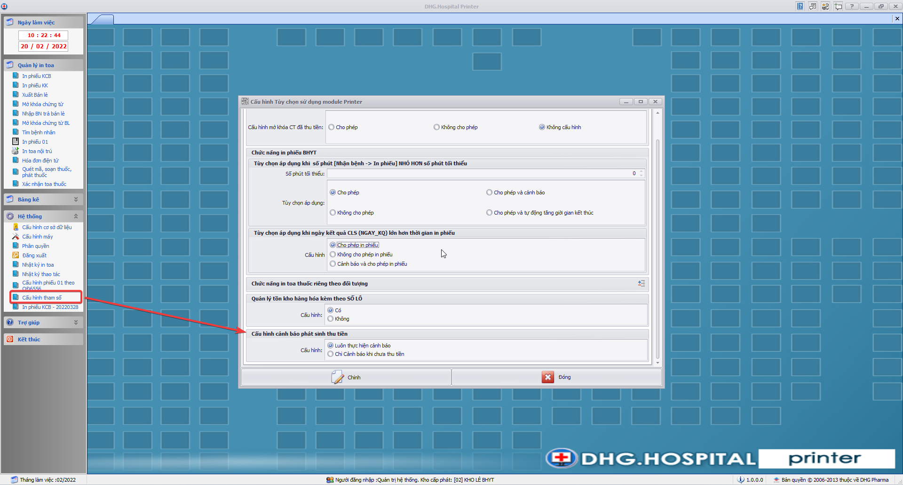
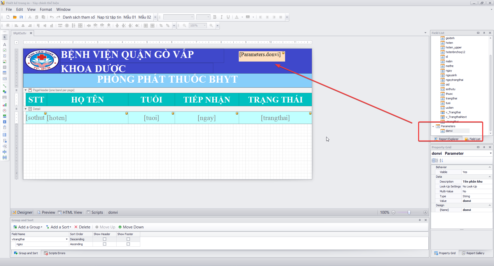
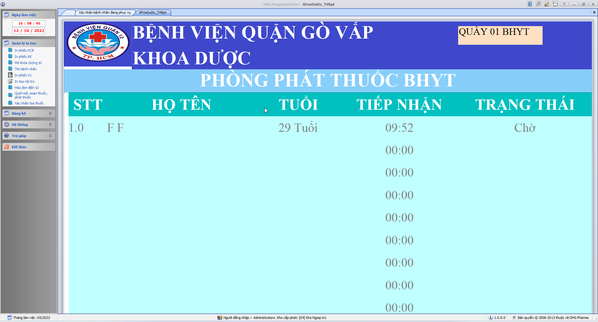
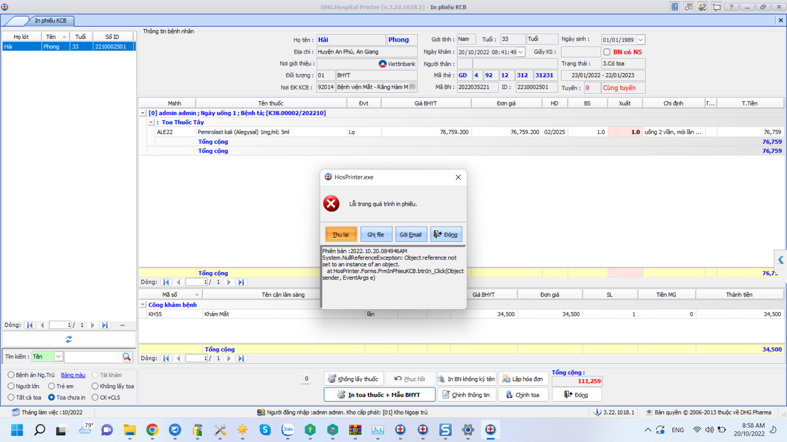
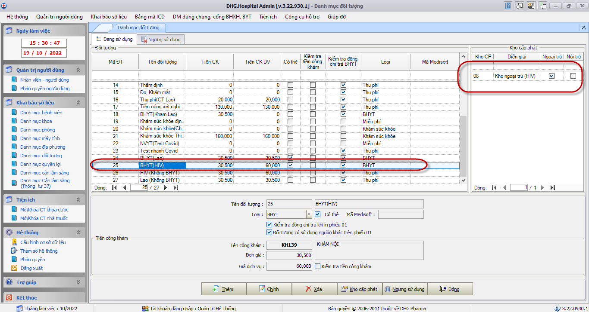
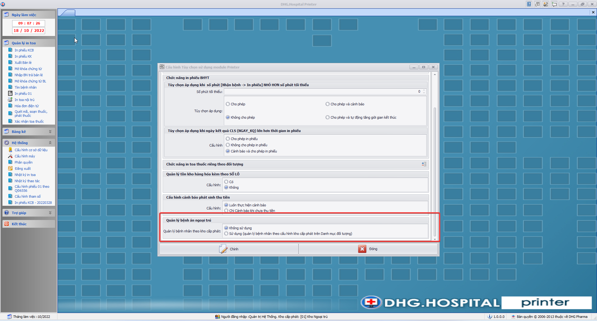

### DHG.Hospital Printer - Thông tin cập nhật

(✨: Chức năng mới,🐛: Chỉnh lỗi, #️⃣: Giải quyết công việc) 

-  🐛: khi in bảng kê đối tượng miễn phí báo lỗi [OK]
-  #️⃣: https://github.com/dh-hos/dhg.hospitalprinter/issues/41 [OK]

-  🐛: Mã thuốc thuộc kho 13, Printer kho lẻ BHYT load thuốc kho 13 [OK]
-  #️⃣: https://github.com/dh-hos/dhg.hospitalprinter/issues/38 [OK]

-  🐛: Toa xuất viện đã in vẫn hiển thị toa chưa in nhưng không thấy thuốc [OK]
-  #️⃣: https://github.com/dh-hos/dhg.hospitalprinter/issues/37 [OK]

-  #️⃣: https://github.com/dh-hos/Mo-ta-he-thong/issues/11 [OK]
-  ✨: Bổ sung chức năng kiểm tra ngày kết quả trong XML3 (NGAY_KQ) nếu lớn hơn thời gian kết thúc không cho phép in phiếu thanh toán. [OK]

-  #️⃣: https://github.com/dh-hos/dhg.hospitalprinter/issues/42 [OK]
-  🐛: Kiểm tra tránh trường hợp trùng đối với chứng từ đã lập phiếu thu (khi bắt đầu lưu chứng từ) [OK]
-  ✨: Cải tiến tốc độ khi lưu chứng từ mới [OK]

-  #️⃣: https://github.com/dh-hos/dhg.hospitalprinter/issues/43 [OK]
-  🐛: Fix Hiển thị thông báo trống - chức năng in phiếu KCB [OK]

-  ✨: Xử lý Trường hợp bật cảnh báo cập nhật giờ kết thúc của hồ sơ, nếu không đồng ý cập nhật sẽ không tiếp tục in phiếu thanh toán [OK]
-  #️⃣: https://github.com/dh-hos/dhg.hospitalprinter/issues/44 [OK]
-  🐛: [Hóa đơn điện tử nhà thuốc] không cho lập hóa đơn khi chưa hoàn thành phiếu thu [OK]

-  #️⃣: https://github.com/dh-hos/dhg.hospitalprinter/issues/45 [OK]
-  🐛: Fix Hóa đơn điện tử nhà thuốc khi vừa lập xong thì không in được [OK]

-  #️⃣: https://github.com/dh-hos/dhg.hospitalprinter/issues/46 [OK]
-  🐛: Fix Printer in bảng kê bị treo thông báo đang xử lý in ấn đối với xác nhận bệnh án ngoại trú [OK]

-  #️⃣: https://github.com/dh-hos/dhg.hospitalprinter/issues/47 [OK]
-  🐛: Fix Bệnh án ngoại trú thanh toán theo đợt khi in bảng kê không trừ kho và đánh dấu đã in - Form in phiếu khám chữa bệnh mới [OK]

-  #️⃣: https://github.com/dh-hos/dhg.hospitalprinter/issues/51 [OK]
-  🐛: Fix lỗi không thể hiện cảnh báo có phát sinh đồng chi trả khi in phiếu 01 [OK]

-  #️⃣: https://github.com/dh-hos/DH.HIS/issues/2 [OK]
-  🐛: Bổ sung license mabvbh=77150 [OK]

-  #️⃣: https://github.com/dh-hos/dhg.hospitalprinter/issues/53 [OK]
-  🐛: Fix thông báo sai, khi bệnh nhân chưa tới ngưỡng thanh toán đồng chi trả [OK]

-  #️⃣: https://github.com/dh-hos/dhg.hospitalprinter/issues/66 [OK]
-  ✨: Thêm cấu hình để tắt cảnh báo bệnh nhân có nhiều toa thuốc (Hệ thống -> Cấu hình tham số -> Cảnh báo số lượng toa thuốc khi in phiếu KCB) [OK]

-  #️⃣: https://github.com/dh-hos/Mo-ta-he-thong/issues/12 [OK]
-  ✨: Thực hiện theo Mô tả thực hiện Thông tư 36/2021/TT-BYT [OK]

-  #️⃣: https://github.com/dh-hos/dhg.hospitalprinter/issues/54 [OK]
-  ✨: Thêm chức năng xuất thông tin bệnh nhân ra tivi áp dụng trường hợp 1 kho có nhiều quầy phát thuốc [Hướng dẫn thực hiện](../MoTaThayDoi/XuatTTBenhnhanRaTivi.md) [OK]

-  #️⃣: https://github.com/dh-hos/dhg.hospitalprinter/issues/55 [OK]
-  🐛: Xử lý loại bỏ trùng TEN_BENH và TEN_BENH_KEM_THEO trên phiếu 6556 [OK]

-  #️⃣: https://github.com/dh-hos/dhg.hospitalprinter/issues/56 [OK]
-  🐛: Fix cảnh báo sai số tiền bệnh nhân đồng chi trả [OK]

-  #️⃣: https://github.com/dh-hos/dhg.hospitalprinter/issues/59 [OK]
-  🐛: Thực hiện kiểm tra in phiếu 01 trước khi cập nhật ngày giờ in phiếu [OK]

-  #️⃣: https://github.com/dh-hos/dhg.hospitalprinter/issues/61 [OK]
-  ✨: Không thực hiện kiểm tra Cận lâm sàng chưa thực hiện đối với trường hợp xác nhận in phiếu của bệnh án ngoại trú thanh toán đợt (luôn cho phép xác nhận in) [OK]
-  ✨: Không thực hiện kiểm tra Cận lâm sàng chưa thực hiện đối với những cận lâm sàng không thuộc phạm vi thanh toán BHYT [OK]
-  🐛: https://github.com/dh-hos/dhg.hospitalprinter/issues/59#issuecomment-1258846397 [OK]

-  #️⃣: https://github.com/dh-hos/dhg.hospitalprinter/issues/67 [OK]
-  🐛: Fix sai cảnh báo sai tiền đồng chi trả đối với bệnh nhân có chi phí thuộc nguồn khác [OK]

-  #️⃣: https://github.com/dh-hos/dhg.hospitalprinter/issues/68 [OK]
-  ✨: Thêm cấu hình để tắt cảnh báo bệnh nhân có phát sinh thu tiền (luôn cảnh báo, cảnh báo khi chi phí chưa thu, thu tiền rồi thì không cảnh báo)  [OK]

-  #️⃣: https://github.com/dh-hos/dhg.hospitalprinter/issues/64 [OK]
-  ✨: Tính sai số phút giữa thời gian in phiếu và thời gian đăng ký khám bệnh khi thực hiện in phiếu 6556 [OK]

-  #️⃣: https://github.com/dh-hos/dhg.hospitalprinter/issues/61 [OK]
-  #️⃣: https://github.com/dh-hos/dhg.hospitalprinter/issues/61#issuecomment-1258979906 [OK]
-  ✨: Không thực hiện kiểm tra Cận lâm sàng chưa thực hiện đối với trường hợp xác nhận in phiếu của bệnh án ngoại trú thanh toán đợt (luôn cho phép xác nhận in) [OK]

-  #️⃣: https://github.com/dh-hos/dhg.hospitalprinter/issues/58#issuecomment-1260306620 [OK]
-  🐛: Lỗi In toa thuốc Than báo lỗi [OK]

-  #️⃣: https://github.com/dh-hos/dhg.hospitalprinter/issues/64 [OK]
-  🐛: Sai thời gian in phiếu [OK]

-  #️⃣: https://github.com/dh-hos/DH.HIS/issues/4 [OK]
-  ✨: Cập nhật bản quyền đối với Mã BV 87190 - BỆNH VIỆN DA LIỄU ĐỒNG THÁP [OK]

-  #️⃣: https://github.com/dh-hos/dhg.hospitalprinter/issues/73 [OK]
-  🐛: Fix lỗi không thể hiện được form thể hiện số thứ tự bệnh nhân ra tivi [OK]

-  #️⃣: https://github.com/dh-hos/dhg.hospitalprinter/issues/54#issuecomment-1274207510 [OK]
-  ✨: Bổ sung chức năng, in phiếu 01 trường hợp chọn option [Tất cả toa], với trạng thái bệnh nhân chưa in, vẫn in số thứ tự vào hệ thống thể hiện số thứ tự trên tivi [OK]

-  ✨: Thêm parameter donvi (Diễn giải quầy phát thuốc) thể hiện form in ra tivi  [OK]
-  #️⃣: https://github.com/dh-hos/dhg.hospitalprinter/issues/54#issuecomment-1275772044 [OK]
-  🐛: Không in được phiếu 01, nhưng vẫn thể hiện số thứ tự [OK]

-  #️⃣: https://github.com/dh-hos/dhg.hospitalprinter/issues/76 [OK]
-  🐛: Lỗi không in được phiếu 01 [OK]

-  #️⃣: https://github.com/dh-hos/dhg.hospitalprinter/issues/77 [OK]
-  🐛: Thêm chức năng xuất xml vào thư mục cấu hình trên admin khi gửi xml lên cổng BHXH đối với mabvbh=87190 [OK]
-  ✨: Xóa thông tin quầy phát thuốc và số thứ tự khi chọn bệnh nhân khác [OK]

-  #️⃣: https://github.com/dh-hos/dhg.hospitalprinter/issues/79 [OK]
-  🐛: Fix lỗi không in được phiếu 01  [OK]

-  #️⃣: https://github.com/dh-hos/dhg.hospitalprinter/issues/81 [OK]
-  ✨: Bổ sung chức năng chọn máy in khi in phiếu thứ tự phát thuốc  [OK]

-  #️⃣: https://github.com/dh-hos/dhg.hospitalservices/issues/12 [OK]
-  ✨: Cải tiến chức năng xuất xml để gửi BHXH khi in phiếu tại module Printer: chỉ xuất xml để gửi BHXH khi cấu hình số lượng trang in phiếu 01 lớn hơn 0, để tránh tình trạng gửi xml nhiều lần trường hợp đã in phiếu 01 ở Prescription [OK]

-  #️⃣: https://github.com/dh-hos/dhg.hospitalprinter/issues/78 [OK]
-  ✨: Bổ sung thêm tùy chọn cho phép quản lý danh sách bệnh nhân BANT theo cấu hình kho cấp phát (cấu hình trên Danh mục Đối tượng trên module Admin) [OK]

-  #️⃣: https://github.com/dh-hos/dhg.hospitalprinter/issues/84 [OK]
-  ✨: Thay đổi [hướng dẫn script hướng dẫn đổi màu trên tivi](../MoTaThayDoi/Outtv/huong-dan-doi-mau-xtra-report.md) [OK]
-  ✨: Thêm phím nóng [F6] để hỗ trợ chức năng mời nhận thuốc [OK]

-  #️⃣: https://github.com/dh-hos/dhg.hospitalprinter/issues/90 [OK]
-  🐛: Fix lỗi sai số thứ tự khi bỏ chọn quầy phát thuốc mặc định [OK]
