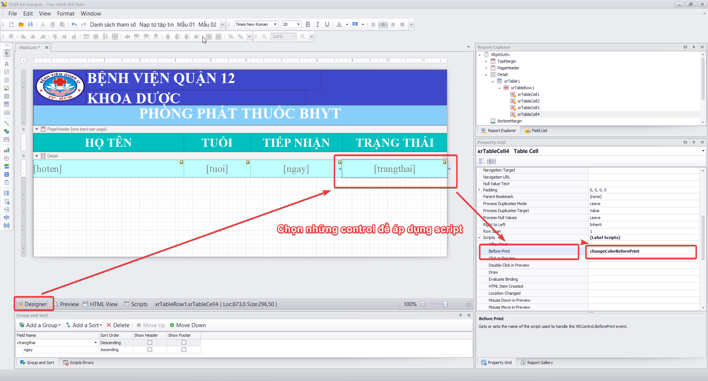

## Hướng dẫn thay đổi màu bệnh nhân trên tivi

### Bước 1: Tạo script để thay đổi màu changeColorBeforePrint

```
private void changeColorBeforePrint(object sender, System.Drawing.Printing.PrintEventArgs e) {
	try {
		DevExpress.XtraReports.UI.XRTableCell control = (DevExpress.XtraReports.UI.XRTableCell)sender;
		if (control.Text == "Mời nhận thuốc") {
			control.ForeColor = System.Drawing.Color.Red;
		} else {
			control.ForeColor = System.Drawing.Color.Gray;
		}
	} catch { }
}
```


### Bước 2: Chọn những control thay đổi màu


