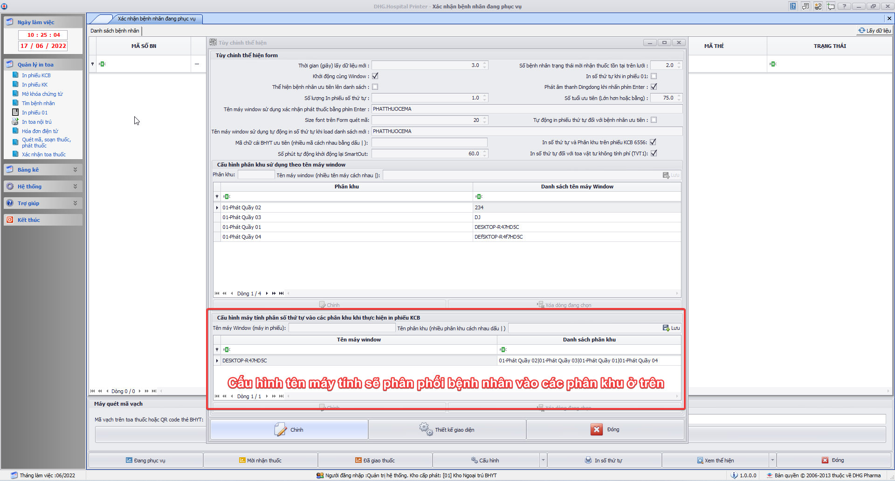
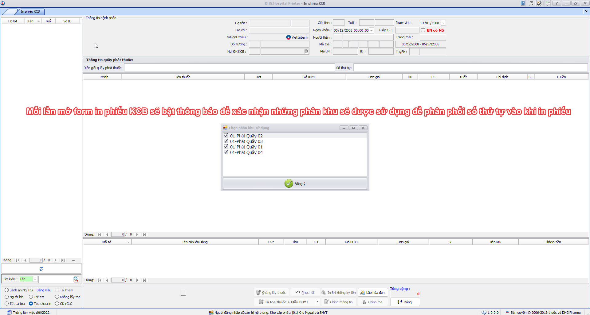

### Hướng dẫn cấu hình xuất thông tin bệnh nhân ra tivi

#### Bước 1: Cấu hình máy tính thực hiện phân phối số bệnh nhân vào các quầy phát thuốc

#### Bước 2: Cấu hình chức năng cho phép truyền thông tin quầy phát thuốc và số thứ tự treen phiếu 6556

#### Bước 3: Cấu hình thể hiện diễn giải quầy phát thuốc và số thứ tự trên phiếu 6556

#### Chức năng: Thực hiện chọn những phân khu sử dụng trong quá trình in phiếu (phải thực hiện bước này mỗi khi mở form in phiếu KCB)

